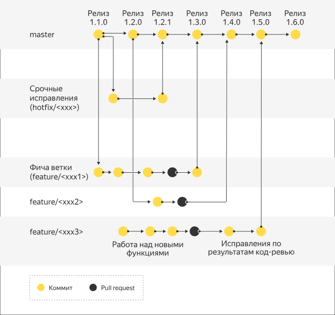

# ML_Ops

## Проект в рамках учебной дисциплины "Технологии и практики MLOps"

**Участник**: Остапчук Анастасия Витальевна

# Как я работаю по GitHub Flow

Я веду проект в одиночку и использую простой **GitHub Flow**, чтобы быстро и надёжно выпускать изменения.



1. **main всегда зелёная** — из неё происходит деплой.
2. **Ветки от main** — каждая фича или фикс в своей ветке (`feature/...`, `hotfix/...`).
3. **PR → CI → merge** — пушу ветку, открываю PR, CI проверяет код, после одобрения мёржу в `main`.
4. **Удаляю ветку** — чтобы не засорять репозиторий.

**Плюсы:**

* Меньше веток и конфликтов
* Непрерывный деплой
* Чистая и понятная история изменений

# Домашнее задание 2

1. Выбрана система версионирования данных DVC

    - установка DVC
        ```shell
        uv add dvc
        ```
    - конфигурация удалённого хранилища 
    (собственный WEB-сервер с использованием протокола WebDAV)
        ```shell
        dvc remote add -d myremote webdavs://aspirantdrago.ru/webdav/
        ```
    - Добавление сырых аудио-файлов
        ```shell
        dvc add data/input
        ```
    - Добавление предобработанных аудио-файлов
        ```shell
        dvc add data/outputs
        ```
    - Добавление спектрограмм для непосредственно обучения
        ```shell
        dvc add data/spec_ds
        ```
    - Добавление обученных моделей
        ```shell
        dvc add data/models
        ```
    - Отправка в хранилище
        ```shell
        dvc push
        ```
    - Выгрузка из хранилища
        ```shell
        dvc pull
        ```

2. Добавила сырые данные в систему версионирования 
   [отдельным коммитом](https://github.com/aniciya777/ML_Ops/commit/d78a49af2dea2e81b8d82c4355cc942ccb5276ca).
3. Добавила скрипты для обработки данных
    - Обработка сырых аудиофайлов
   
      `src/preparation/prepare.py`
   
      ```shell
      uv run prepare
      ```
      
    - Создание спектрограмм
   
      `src/preparation/make_specrogram.py`
   
      ```shell
      uv run make_spec
      ```

    Добавила результаты предобработки в систему версионирования отдельными коммитами:
    - [prepared data](https://github.com/aniciya777/ML_Ops/commit/631fafdca3ba2fde97823037883b8c48677c2cb7)
    - [convert to 16bit](https://github.com/aniciya777/ML_Ops/commit/48ee6432055239069887ab44a2b6299a623d0f04)
    - [convert stereo to mono](https://github.com/aniciya777/ML_Ops/commit/5025596e8c3193c5a43f97999123fd2bbe26657d)
    - [remove silence](https://github.com/aniciya777/ML_Ops/commit/20e25f5d5fdcfa8ded1d9f1a62ad4ba43350d35d)
    - [convert to 16000hz](https://github.com/aniciya777/ML_Ops/commit/8b4029bb6c466c477b0ea37459db343f9558dc3e)
    - [padding files](https://github.com/aniciya777/ML_Ops/commits/hw_2/?before=04986885a68f303c57d47a26623edbe8029a6509+35)
    - [Saving spectrograms as an intermediate dataset](https://github.com/aniciya777/ML_Ops/commit/7769e480f3dab87ce5363b8178648809524f0ff5)

4. Написала скрипт для обучения моделей
   
   `src/train/train.py`

   ```shell
   uv run train
   ```   

   и добавила обученные модели в систему версионирования отдельными коммитами:
      - [57fc29a1723b1eba0117bc65a27c9adfa87e9bd5](https://github.com/aniciya777/ML_Ops/commit/57fc29a1723b1eba0117bc65a27c9adfa87e9bd5)
      - [bc962b41aed00095dd6ac41346b7d0ad3c7e56c8](https://github.com/aniciya777/ML_Ops/commit/bc962b41aed00095dd6ac41346b7d0ad3c7e56c8)

5. При помощи DVC API автоматизировали выгрузку моделей и сравнение их на тестовых данных
   
   `src/validation/validation.py`

   Хэши/тэги нужных коммитов берутся из файла `data/сomparison_of_revisions.txt`.

   ```shell
   uv run validate
   ```
   
   Отчёт автоматически сохраняется в формате Markdown в файле
   [comparison_versions.md](comparison_versions.md).
