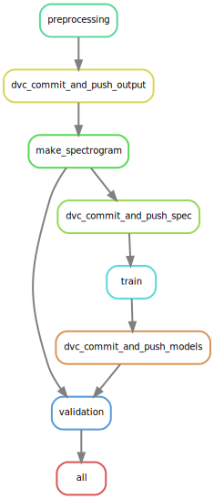
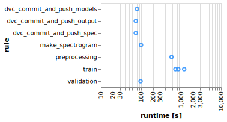

# ML_Ops

## Проект в рамках учебной дисциплины "Технологии и практики MLOps"

**Участник**: Остапчук Анастасия Витальевна

# Как я работаю по GitHub Flow

Я веду проект в одиночку и использую простой **GitHub Flow**, чтобы быстро и надёжно выпускать изменения.


1. **main всегда зелёная** — из неё происходит деплой.
2. **Ветки от main** — каждая фича или фикс в своей ветке (`feature/...`, `hotfix/...`).
3. **PR → CI → merge** — пушу ветку, открываю PR, CI проверяет код, после одобрения мёржу в `main`.
4. **Удаляю ветку** — чтобы не засорять репозиторий.

**Плюсы:**

* Меньше веток и конфликтов
* Непрерывный деплой
* Чистая и понятная история изменений

# Домашнее задание 2

1. Выбрана система версионирования данных DVC

    - установка DVC
        ```shell
        uv add dvc
        ```
    - конфигурация удалённого хранилища 
    (собственный WEB-сервер с использованием протокола WebDAV)
        ```shell
        dvc remote add -d myremote webdavs://aspirantdrago.ru/webdav/
        ```
    - Добавление сырых аудио-файлов
        ```shell
        dvc add data/input
        ```
    - Добавление предобработанных аудио-файлов
        ```shell
        dvc add data/outputs
        ```
    - Добавление спектрограмм для непосредственно обучения
        ```shell
        dvc add data/spec_ds
        ```
    - Добавление обученных моделей
        ```shell
        dvc add data/models
        ```
    - Отправка в хранилище
        ```shell
        dvc push
        ```
    - Выгрузка из хранилища
        ```shell
        dvc pull
        ```

2. Добавила сырые данные в систему версионирования 
   [отдельным коммитом](https://github.com/aniciya777/ML_Ops/commit/d78a49af2dea2e81b8d82c4355cc942ccb5276ca).
3. Добавила скрипты для обработки данных
    - Обработка сырых аудиофайлов
   
      `src/preparation/prepare.py`
   
      ```shell
      uv run prepare
      ```
      
    - Создание спектрограмм
   
      `src/preparation/make_specrogram.py`
   
      ```shell
      uv run make_spec
      ```

    Добавила результаты предобработки в систему версионирования отдельными коммитами:
    - [prepared data](https://github.com/aniciya777/ML_Ops/commit/631fafdca3ba2fde97823037883b8c48677c2cb7)
    - [convert to 16bit](https://github.com/aniciya777/ML_Ops/commit/48ee6432055239069887ab44a2b6299a623d0f04)
    - [convert stereo to mono](https://github.com/aniciya777/ML_Ops/commit/5025596e8c3193c5a43f97999123fd2bbe26657d)
    - [remove silence](https://github.com/aniciya777/ML_Ops/commit/20e25f5d5fdcfa8ded1d9f1a62ad4ba43350d35d)
    - [convert to 16000hz](https://github.com/aniciya777/ML_Ops/commit/8b4029bb6c466c477b0ea37459db343f9558dc3e)
    - [padding files](https://github.com/aniciya777/ML_Ops/commits/hw_2/?before=04986885a68f303c57d47a26623edbe8029a6509+35)
    - [Saving spectrograms as an intermediate dataset](https://github.com/aniciya777/ML_Ops/commit/7769e480f3dab87ce5363b8178648809524f0ff5)

4. Написала скрипт для обучения моделей
   
   `src/train/train.py`

   ```shell
   uv run train
   ```   

   и добавила обученные модели в систему версионирования отдельными коммитами:
      - [57fc29a1723b1eba0117bc65a27c9adfa87e9bd5](https://github.com/aniciya777/ML_Ops/commit/57fc29a1723b1eba0117bc65a27c9adfa87e9bd5)
      - [bc962b41aed00095dd6ac41346b7d0ad3c7e56c8](https://github.com/aniciya777/ML_Ops/commit/bc962b41aed00095dd6ac41346b7d0ad3c7e56c8)

5. При помощи DVC API автоматизировали выгрузку моделей и сравнение их на тестовых данных
   
   `src/validation/validation.py`

   Хэши/тэги нужных коммитов берутся из файла `data/сomparison_of_revisions.txt`.

   ```shell
   uv run validate
   ```
   
   Отчёт автоматически сохраняется в формате Markdown в файле
   [comparison_versions.md](comparison_versions.md).

# Домашнее задание 3

1. В качестве системы управления пайплайнами выбран
[Snakemake](https://snakemake.readthedocs.io/en/stable/).

2. `Snakemake` уже установлен в Docker-образе:

```shell
   uv add snakemake>=9.6.2
```

3. Пайплайн может быть запущен через `Docker`:

```shell
  docker run --rm -it -p 8000:8000 $(docker build -q .)
```

4. Структура пайплайна:



   - ## Правила обработка данных:
     - ### `preprocessing` 
       \- конвертация исходных аудиофайлов из каталога 
       `data/input/ML` в формат `.WAV` и их последующая предобработка.
       Обработанные файлы сохраняются в каталоге `data/output/ML`
     - ### `dvc_commit_and_push_output`
       \- сохранение предобработанных аудиофайлов в системе версионирования `DVC`
       и загрузка на удалённое хранилище
     - ### `make_spectrogram`
       \- генерация спектрограмм и сохранение их в каталоге `data/spec_ds`
     - ### `dvc_commit_and_push_spec`
       \- сохранение спектрограмм в системе версионирования `DVC`
       и загрузка на удалённое хранилище
   - ## Правила обучения моделей
     - ### `train`
       \- непосредственно обучение моделей с применением кросс-валидации
     - ### `dvc_commit_and_push_models`
       \- сохранение моделей в системе версионирования `DVC`
       и загрузка на удалённое хранилище
   - ## Правила тестирования моделей
     - ### `validation`
       \- валидация моделей из системы контроля экспериментов `ClearML`;
       генерация отчёта [comparison_versions.md](comparison_versions.md)

5. По последнему выполненному пайплайну можно сгенерировать 
   [отчёт](static/report.html):

```shell
  uv run snakemake --report static/report.html
```

6. В [отчёте](static/report.html) также содержится оценка времени выполнения
   каждого шага пайплайна. Пример:
   

# Домашнее задание 4

1. Для трекинга экспериментов в проекте используется [ClearMl](https://clear.ml). 
   Это открытая MLOps-платформа, сочетающая в себе управление экспериментами, 
   хранение данных и оркестрацию пайплайнов.

   Почему ClearML?

   - **Быстрый старт**: достаточно установить Python-пакет и чуть настроить коннектор.
   - **Гибкая архитектура**: есть облачный SaaS-сервис, можно поднять свой сервер (on-premise) через Docker.
   - **Удобство в коде**: простой API для инициализации задач, логирования метрик, артефактов и гиперпараметров.
   - **Расширенный функционал**: трекинг датасетов, построение конвейеров (Pipelines), распределённое обучение.

    Установка клиента в качестве Python-пакета *(уже установлен в Docker-образе)*

    ```shell
       uv add clearml>=2.0.1
    ```

    ### Конфигурация подключения:

    - **Вариант A: Использовать бесплатный облачный сервер**

      Выполните интерактивную настройку:

      ```shell
        clearml-init
      ```
    
    - **Вариант B: Поднять собственный сервер**

      ```shell
        docker-compose -f docker-compose-clearml.yaml up -d 
      ```
      
      По умолчанию сервис доступен на порту `8080`, API – на `8008`.
   
    ### Переменные окружения (опционально)
    
    Вместо `clearml-init` можно сразу в среде задать:

    ```
        export CLEARML_API_HOST="https://your-clearml-api:8008"
        export CLEARML_WEB_HOST="https://your-clearml-web:8080"
        export CLEARML_API_ACCESS_KEY="..."
        export CLEARML_API_SECRET_KEY="..."
    ```

2. Были выполнены 3 эксперимента с разным `batch_size`:

   - `batch_size = 16`
   - `batch_size = 32` *(по-умолчанию)*
   - `batch_size = 64`

   Все этапы (2 шага препроцессинга, обучения и валидация) логируются в систему трекинга эксперимента.

   Пример WEB-интерфейса `ClearML`:
   
   

    В систему трекинга экспериментов `ClearML` логируются:
    - сырые исходные данные
    - обработанные данные
    - обученные модели
    - гиперпараметры
    - метрики обучения
    - стандартный вывод
    - графики `matplotlib` и `seaborn`
    - параметры командной строки, используемые для запуска отдельных шагов пайплайна

3. Используя сохранённые в качестве артефактов модели на этапе валидации
   производится сравнительный анализ между 3 последними стадиями обучения 
   всех моделей кросс-валидации

4. Отчёт автоматически сохраняется в формате Markdown в файле
   [comparison_versions.md](comparison_versions.md).
