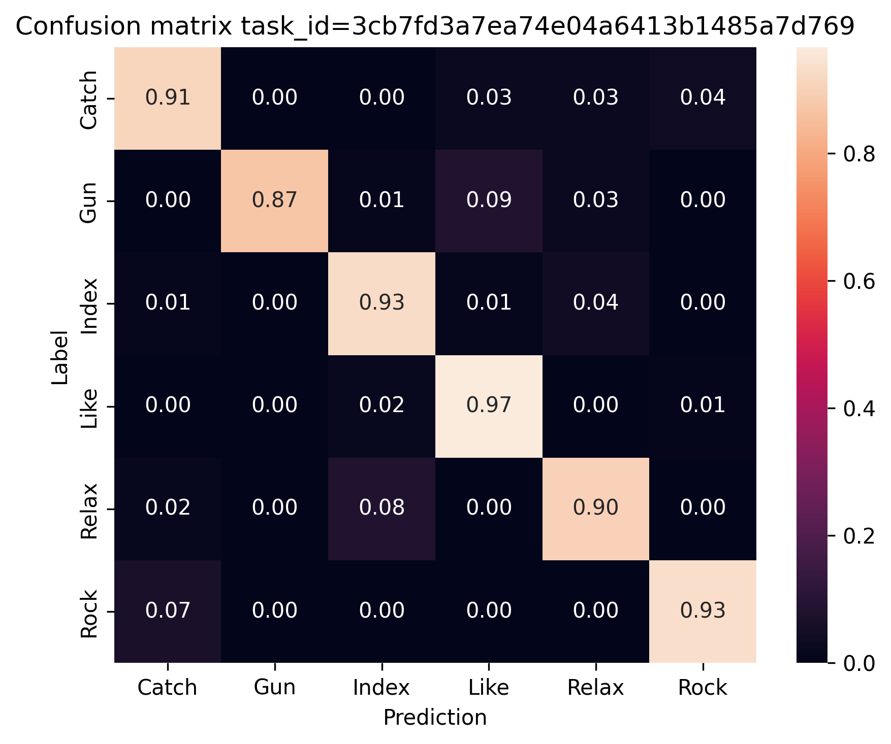
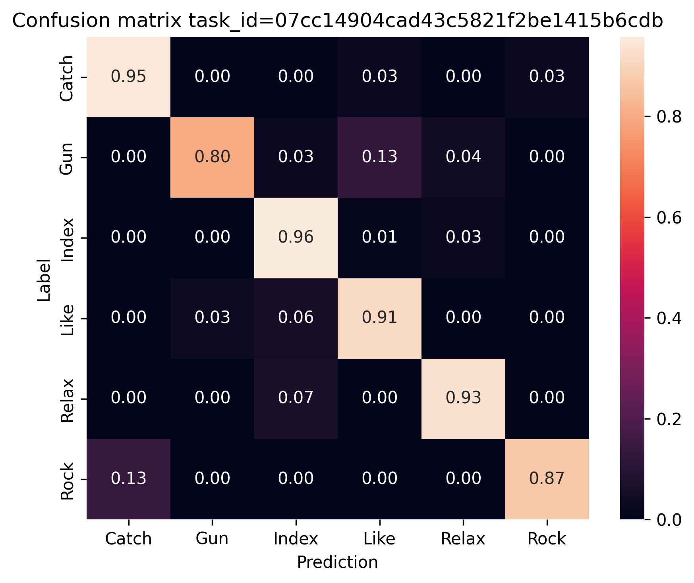
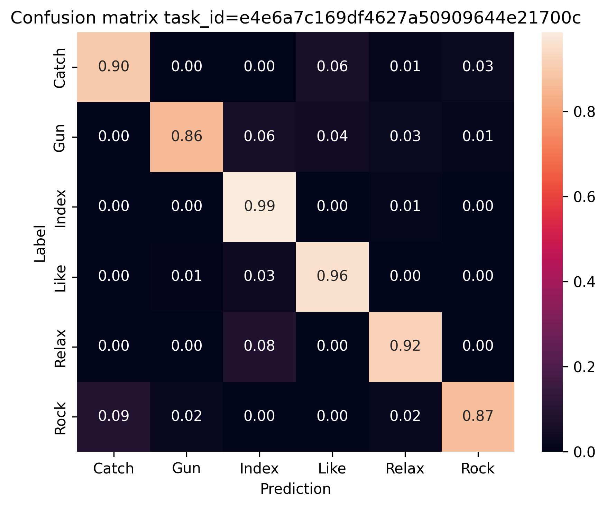

# Сравнение версий модели на тесте

## ClearML task id `3cb7fd3a7ea74e04a6413b1485a7d769`
Открыть по [ссылке](http://localhost:8080/projects/405d2c44e9a74777b897911912958e84/experiments/3cb7fd3a7ea74e04a6413b1485a7d769/output/log)

- *batch_size*: `32`
- *epochs*: `1000`
- *folds*: `5`
- *learning_rate*: `0.001`
- *output_dir*: `data/models/batch32`

**Accuracy**: `0.9205` 

| Class | Precision | Recall | F1 score |
|:------|:---------:|:------:|:--------:|
| **Catch** | `0.9367` | `0.9125` | `0.9242` |
| **Gun** | `1.0000` | `0.8714` | `0.9285` |
| **Index** | `0.8919` | `0.9286` | `0.9087` |
| **Like** | `0.9059` | `0.9667` | `0.9344` |
| **Relax** | `0.8952` | `0.9000` | `0.8948` |
| **Rock** | `0.9200` | `0.9333` | `0.9251` |

## ClearML task id `07cc14904cad43c5821f2be1415b6cdb`
Открыть по [ссылке](http://localhost:8080/projects/405d2c44e9a74777b897911912958e84/experiments/07cc14904cad43c5821f2be1415b6cdb/output/log)

- *batch_size*: `64`
- *epochs*: `1000`
- *folds*: `5`
- *learning_rate*: `0.001`
- *output_dir*: `data/models/batch64`

**Accuracy**: `0.9060` 

| Class | Precision | Recall | F1 score |
|:------|:---------:|:------:|:--------:|
| **Catch** | `0.9294` | `0.9500` | `0.9390` |
| **Gun** | `0.9548` | `0.8000` | `0.8679` |
| **Index** | `0.8621` | `0.9571` | `0.9061` |
| **Like** | `0.8759` | `0.9111` | `0.8900` |
| **Relax** | `0.9205` | `0.9333` | `0.9260` |
| **Rock** | `0.9550` | `0.8667` | `0.9042` |

## ClearML task id `e4e6a7c169df4627a50909644e21700c`
Открыть по [ссылке](http://localhost:8080/projects/405d2c44e9a74777b897911912958e84/experiments/e4e6a7c169df4627a50909644e21700c/output/log)

- *batch_size*: `16`
- *epochs*: `1000`
- *folds*: `5`
- *learning_rate*: `0.001`
- *output_dir*: `data/models/batch16`

**Accuracy**: `0.9181` 

| Class | Precision | Recall | F1 score |
|:------|:---------:|:------:|:--------:|
| **Catch** | `0.9506` | `0.9000` | `0.9228` |
| **Gun** | `0.9690` | `0.8571` | `0.9082` |
| **Index** | `0.8543` | `0.9857` | `0.9148` |
| **Like** | `0.9163` | `0.9556` | `0.9351` |
| **Relax** | `0.9238` | `0.9167` | `0.9185` |
| **Rock** | `0.9400` | `0.8667` | `0.8961` |

